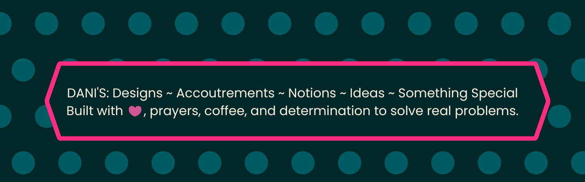

**Prayerful Problem Solver** -- Freelance Virtual Ministry Assistant -- Self-Taught Developer

30 years of crochet expertise and a passion for solving real problems with technology. My work lives at the intersection of traditional craft and modern tools -- building platforms that serve the crochet community and the churches I support.


### What I'm Building

**[CrochetAdjust](https://this4dani.com)** -- A crochet pattern adjustment platform built on FastAPI.

Crocheters shouldn't have to manually recalculate an entire pattern just because they switched yarn or hook size. CrochetAdjust takes any pattern and adjusts it automatically -- gauge, yarn substitution, hook size, stitch counts, yardage -- through a five-stage processing pipeline:

```
Input > Translation > Canonical Model > Adjustment Engine > Output
```

- Multilingual support (10+ languages planned)
- Rule-based adjustment engine with AI expansion roadmap
- Multiple output formats (PDF, condensed, SVG chart, slideshow)
- Ravelry API integration for yarn intelligence

**[Interactive Crochet Glossary](https://this4dani.com/glossary.html)** -- 255+ searchable, filterable crochet terms with US/UK conversions, difficulty ratings, and stitch relationships. Includes flashcard study mode.


### Tech Stack

`FastAPI` | `Python` | `Pydantic` | `HTML/CSS/JS` | `GitHub Pages` | `Ravelry API`


### Looking For

- **Collaborators** who share a love for craft + code
- **Beta testers** for the CrochetAdjust MVP
- **Feedback** on the glossary and pattern tools


### Connect

- [this4dani.com](https://this4dani.com)
- [LinkedIn](https://linkedin.com/in/ashleydaniellecaldwell)
- [Pinterest](https://pinterest.com/this4dani)
- [Ravelry](https://ravelry.com/people/This4dani)
- [Linq](https://linqapp.com/this4dani)



